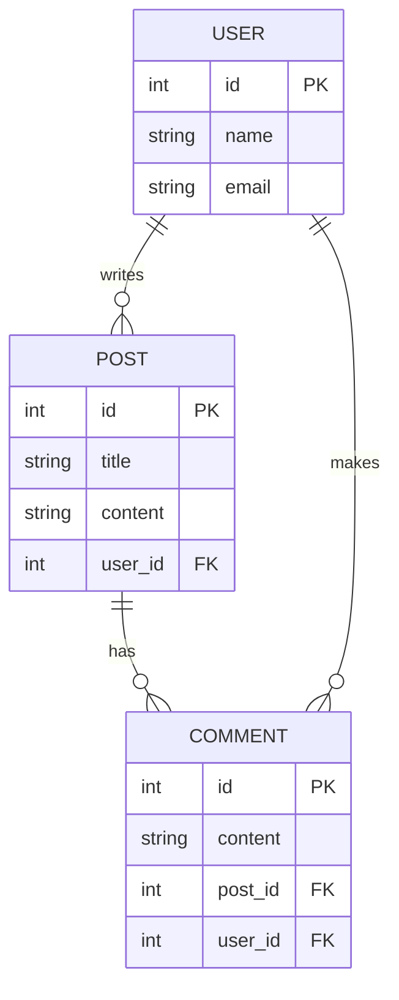

```markdown

```mermaid
erDiagram
    USER {
        int id PK
        string name
        string email
    }
    POST {
        int id PK
        string title
        string content
        int user_id FK
    }
    COMMENT {
        int id PK
        string content
        int post_id FK
        int user_id FK
    }

    USER ||--o{ POST : "writes"
    POST ||--o{ COMMENT : "has"
    USER ||--o{ COMMENT : "makes"
```